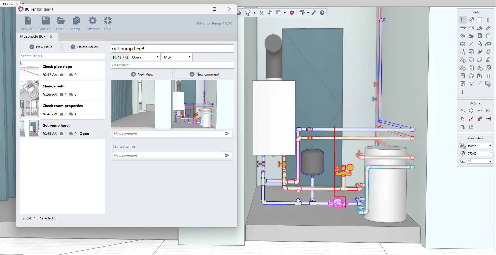

<a href="index.html">eng</a>

# O BCFier #

**BCFier for Renga** - это плагин с открытым исходным кодом для работы с BCF-отчетами в Renga. BCF-отчет - это файл с расширением .bcf, который содержит одно или несколько замечаний по проекту. Вы можете использовать BCF-файлы для совместной работы над проектом в Renga.

С помощью BCFier для Renga вы можете:

- открывать и создавать BCF-файлы;
- добавлять замечания;
- добавлять скриншоты видов с графическими аннотациями;
- cохранять точки взгляда с состоянием видимости и выбора объектов;
- добавлять комментарии к замечаниям;
- переключать виды.

О том, как работать с BCFier для Renga, читайте в [Справке](./HELP_RU.html).

# Открытый исходный код #
 
BCFierForRenga - это клиент [BCF](https://github.com/BuildingSMART/BCF-XML) для Renga с открытым исходным кодом. Этот проект основан на проекте [BCFier](https://github.com/teocomi/BCFier).
Чтобы собрать плагин, просто форкните [repo](https://github.com/tyan/BCFierForRenga) и скачайте последнюю версию [Renga SDK](https://rengabim.com/sdk/).

# Вопросы и предложения #

Пожалуйста, не стесняйтесь сообщать о проблемах и предлагать улучшения на странице проекта на [GitHub](https://github.com/tyan/BCFierForRenga/issues).

